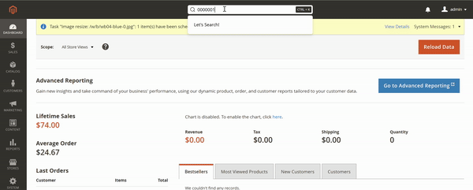

# Magento 2 Admin Search Module


## Overview 🚀

The Magento 2 Admin Search Module enhances the global search functionality in the admin panel by enabling fast 
and efficient searches through the main entities. It addresses the limitations of the default Magento global search, 
offering a more noticeable and performant solution.



## Benefits 🎉

- ⚡ **Performance**: The module leverages ElasticSearch/OpenSearch for search operations, ensuring fast and efficient results even with large datasets.
- 👀 **Visibility**: Unlike the default search, the enhanced search is more noticeable and user-friendly, streamlining admin workflows.
- 🔒 **Access Control**: The module respects Magento ACL permissions, ensuring users only see results they are authorized to access, maintaining security and compliance.

## Installation 🔧

```shell
composer require vasileuski/magento2-module-admin-search
```

## Troubleshooting 🛠️

If no results are displayed in the search bar, execute the following CLI command to ensure proper indexing:

```shell
bin/magento indexer:reindex admin_search_catalog_price_rules admin_search_cart_price_rules admin_search_categories admin_search_customers admin_search_orders admin_search_pages admin_search_products
```

## License 📄

This module is open-source and licensed under the [MIT License](LICENSE.txt).

## Support and Contact 💬

For any issues, feature requests, or contributions, please open an issue on the GitHub repository.
